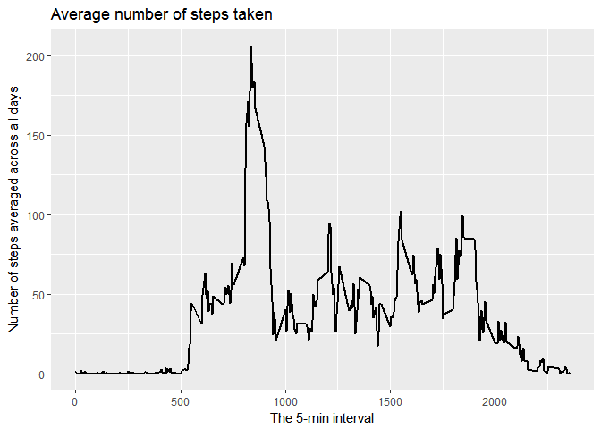

## Loading and preprocessing the data

Load the data.
Process/transform the data (if necessary) into a format suitable for your analysis.


```r
library(dplyr)
library(ggplot2)
library(magrittr)

data <- read.csv("activity.csv")
```

## What is mean total number of steps taken per day?

Calculate the total number of steps taken per day.
Make a histogram of the total number of steps taken each day.


```r
data %>% 
    group_by(date) %>% 
    summarise(total = sum(steps, na.rm = TRUE)) %>% 
    ggplot(., aes(total)) + 
    geom_histogram(binwidth = 1000) +
    labs(title = "Total number of steps taken each day") +
    labs(x = "Number of steps per day") + 
    labs(y = "Number of days")
```

<!-- -->

Calculate and report the mean and median of the total number of steps taken per day.


```r
# calculate mean
data %>% 
    group_by(date) %>% 
    summarise(total = sum(steps, na.rm = TRUE)) %>% 
    .$total %>% 
    mean %>% 
    cat("Mean number of steps taken each day: ", ., "\n")
```

```
## Mean number of steps taken each day:  9354.23
```

```r
# calculate median
data %>% 
    group_by(date) %>% 
    summarise(total = sum(steps, na.rm = TRUE)) %>% 
    .$total %>% 
    median %>% 
    cat("Median number of steps taken each day: ", ., "\n")
```

```
## Median number of steps taken each day:  10395
```

## What is the average daily activity pattern?

Make a time series plot (i.e. type = "l") of the 5-minute interval (x-axis) and the average number of steps taken, averaged across all days (y-axis).


```r
data %>% 
    group_by(interval) %>% 
    summarise(mean = mean(steps, na.rm = TRUE)) %>%
    ggplot(., aes(x = interval, y = mean)) + 
    geom_line(size = 1) +
    labs(title = "Average number of steps taken") +
    labs(x = "The 5-min interval") + 
    labs(y = "Number of steps averaged across all days")
```

<!-- -->

Which 5-minute interval, on average across all the days in the dataset, contains the maximum number of steps?


```r
data %>% 
    group_by(interval) %>% 
    summarise(mean = mean(steps, na.rm = TRUE)) %>%
    .$mean %>% 
    which.max %>%
    data$interval[.]
```

```
## [1] 835
```

## Imputing missing values

Note that there are a number of days/intervals where there are missing values (coded as NA). The presence of missing days may introduce bias into some calculations or summaries of the data.

Calculate and report the total number of missing values in the dataset (i.e. the total number of rows with NAs)


```r
data %>% 
    is.na %>% 
    table %>% 
    .[2] %>% 
    as.integer
```

```
## [1] 2304
```

Devise a strategy for filling in all of the missing values in the dataset. The strategy does not need to be sophisticated. For example, you could use the mean/median for that day, or the mean for that 5-minute interval, etc.

Create a new dataset that is equal to the original dataset but with the missing data filled in.


```r
#replace NAs with the mean for that 5-minute interval
mean.steps.by.interval <- data %>% 
    group_by(interval) %>% 
    summarise(mean = mean(steps, na.rm = TRUE))

data.na.replaced <- data

#create new dataset
data.na.replaced$steps[is.na(data.na.replaced$steps)] <- mean.steps.by.interval$mean[is.na(data.na.replaced$steps)]

rm(mean.steps.by.interval)
```

Function "multiplot" for ploting multiple ggplot2 graphs on one page has been taken from http://www.cookbook-r.com/Graphs/Multiple_graphs_on_one_page_(ggplot2)/


Make a histogram of the total number of steps taken each day.


```r
g1 <- data %>% 
    group_by(date) %>% 
    summarise(total = sum(steps, na.rm = TRUE)) %>% 
    ggplot(., aes(total)) + 
    geom_histogram(binwidth = 1000) +
    labs(title = "Total steps per day (with NAs)") +
    labs(x = "Number of steps per day") + 
    labs(y = "Number of days") +
    coord_cartesian(ylim = c(0, 10.1))

g2 <- data.na.replaced %>% 
    group_by(date) %>% 
    summarise(total = sum(steps, na.rm = TRUE)) %>% 
    ggplot(., aes(total)) + 
    geom_histogram(binwidth = 1000) +
    labs(title = "Total steps per day (NAs replaced)") +
    labs(x = "Number of steps per day") + 
    labs(y = "Number of days") +
    coord_cartesian(ylim = c(0, 10.1))

multiplot(g1, g2, cols = 2)
```

<!-- -->

Calculate and report the mean and median total number of steps taken per day. Do these values differ from the estimates from the first part of the assignment?


```r
# calculate mean
data %>% 
    group_by(date) %>% 
    summarise(total = sum(steps, na.rm = TRUE)) %>% 
    .$total %>% 
    mean %>% 
    cat("Mean number of steps taken per day (NAs present): ", ., "\n")
```

```
## Mean number of steps taken per day (NAs present):  9354.23
```

```r
data.na.replaced %>% 
    group_by(date) %>% 
    summarise(total = sum(steps, na.rm = TRUE)) %>% 
    .$total %>% 
    mean %>% 
    cat("Mean number of steps taken per day (NAs replaced): ", ., "\n")
```

```
## Mean number of steps taken per day (NAs replaced):  9530.724
```

```r
# calculate median
data %>% 
    group_by(date) %>% 
    summarise(total = sum(steps, na.rm = TRUE)) %>% 
    .$total %>% 
    median %>% 
    cat("Median number of steps taken per day (NAs present): ", ., "\n")
```

```
## Median number of steps taken per day (NAs present):  10395
```

```r
data.na.replaced %>% 
    group_by(date) %>% 
    summarise(total = sum(steps, na.rm = TRUE)) %>% 
    .$total %>% 
    median %>% 
    cat("Median number of steps taken per day (NAs replaced): ", ., "\n")
```

```
## Median number of steps taken per day (NAs replaced):  10439
```

What is the impact of imputing missing data on the estimates of the total daily number of steps?

**When missing data (NAs) are imputed so that they are replaced with the mean for that 5-minute interval, mean number of steps taken per day decreases a little, while the median number of steps taken per day increases a little.**

## Are there differences in activity patterns between weekdays and weekends?

For this part the weekdays() function may be of some help here. Use the dataset with the filled-in missing values for this part.

Create a new factor variable in the dataset with two levels – “weekday” and “weekend” indicating whether a given date is a weekday or weekend day.


```r
data.na.replaced[,"weekday"] <- data.na.replaced$date %>% 
    as.Date %>% 
    weekdays(abbr = TRUE)

data.na.replaced[,"weekpart"] <- "weekday"
data.na.replaced$weekpart[data.na.replaced$weekday %in% c("sub", "ned")] <- "weekend"

data.na.replaced$weekday <- NULL
data.na.replaced$weekpart %<>% as.factor

data.na.replaced %>% 
    group_by(interval, weekpart) %>% 
    summarise(mean = mean(steps, na.rm = TRUE)) %>%
    ggplot(., aes(x = interval, y = mean)) + 
    geom_line(size = 1) +
    facet_grid(. ~ weekpart) +
    labs(title = "Average number of steps taken") +
    labs(x = "The 5-min interval") + 
    labs(y = "Average number of steps in the time interval")
```

<!-- -->

**There are differences in activity patterns between weekdays and weekends.**
